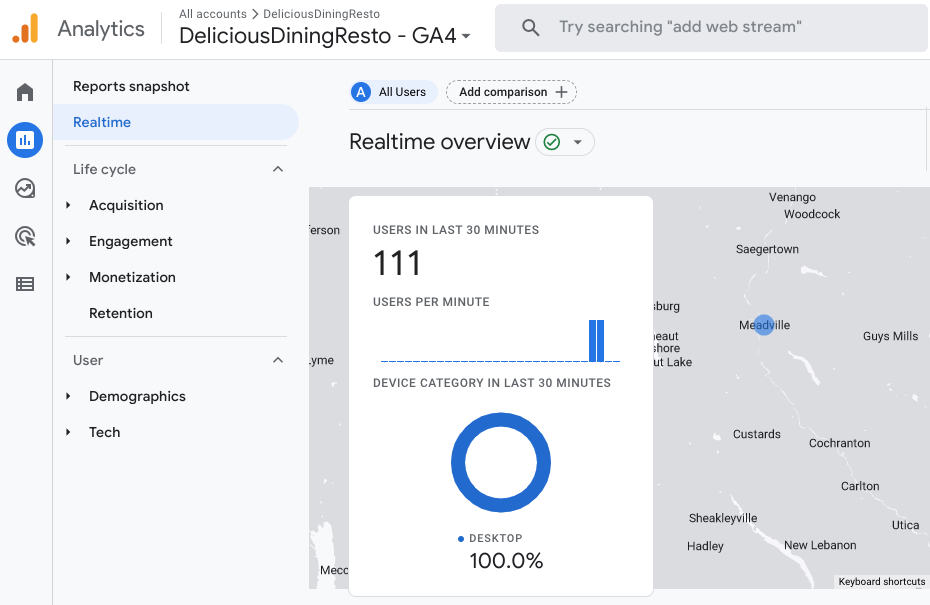
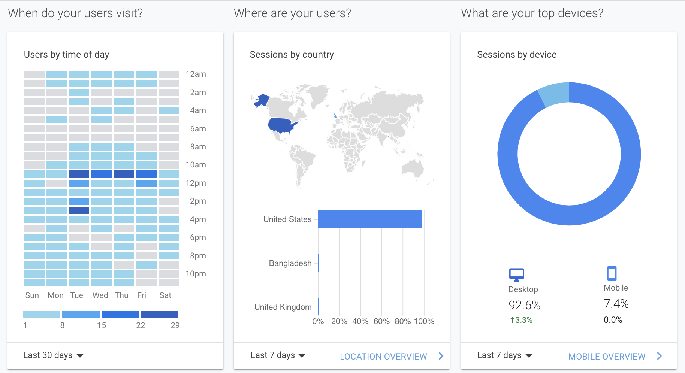

# Data Analytics (CS301) Lab 2 Assignment

Web Traffic Analytics

**Assigned** : Monday 30 January 2023

**Due** : Monday 13 Febuary 2023 (two week lab)

Figure 1: Google Analytics allows admins to study the traffic and activities on webpages. Infor- mation includes the number of viewers online, and the number of documents that they are viewing currently, as shown.

## Project Goals

The main goals of this work include the following.

* To investigate and summarize important aspects of web analytics
* To learn and understand how to make sense of the web traffic dash board.
* To communicate some of the technical aspects of the analysis web traffic.
* To think critically about potential ethical limitations in analysis.

## Google Analytics

Asking visitors complete an online survey to gain insights of their website experience is no longer viable -- users do not like taking surveys. Instead, developers and website admins are able to make educated guesses about the experience of their websites by watching the behaviors of their visitors.

The Google Analytics (GA) framework provides convenient analysis for the un-intrusive study of web traffic on web sites. The results of analyses can be viewed in plots similar to those shown in Figure 2. The study of plots such as, histograms, charts, tables and similar graphics, allows one to conveniently track website activities and to make decisions based on the behaviors and interests of previous visors to the platform.

## Part 1: Visualization Techniques

Figure 2: There are a number of different plots available on the dashboard of Google Analytics. One may ask how each type of plots is able to answer specific types of questions in website maintenance.

In the first part of this lab, you are asked to explore some of the visualizing techniques that GA provides. Please answer the following questions using clear and meaningful language. Your responses will be placed in the File `writing/reflection.md`, should address the question, and be written in clear and meaningful language. Generally, you will have abut twenty to thirty words per response. Note, there are many answers that could equally be considered correct with sufficient discussion.

### Q1: Business

You are a system admin who studies web traffic data for an e-commerce online sales web site similar to Amazon. Which one (1) measurement tool (other than simple pageviews) found on your web analytics dashboard could be argued to be one of the most important measurements for studying potential business activity? Explain your reasoning?

### Q2: Social Media

You are a system admin who studies web traffic data for a social media web site similar to Facebook. Which one (1) measurement tool (other than simple pageviews) found on your web analytics dashboard could be argued to be one of the most important measurements for studying log-in to log-out usage? Explain your reasoning.

### Q3: Campus Calendar

At Allegheny College, the Registrar uses a website to supply forms to students for their override requests. What type of measurement (other than pageviews) found on your web analytics dashboard could be the argues to be the most important for studying site usage? Explain your reasoning.

### Q4: Introspection

Reflect on the tools and plots that you chose for the previous three questions. For each tool, discuss how the tool would **not** be helpful in a particular situation. Please explain the situation and then discuss how the tool would fail to deliver any meaningful results to the admin.

### Q5: Measurements in Relation to the Web Site

Choose a tool or plot tool that must be understood in light of the website's goals in order to give any meaningful information. Explain your reasoning.

### Q6: Hypothetical Question

Imagine that you are an administrator of the website of a large bank. The site allows account-holders to check balances (checking and savings), and complete other important banking tasks online.

You have noticed that no one has checked their savings balance in spite of the fact that thousands of people have logged into the site during the last few days. You suspect that something is wrong with the website somewhere.

Using at least three (3) different tools of types of plots available from the analytics dashboard belonging to the bank's website, describe plots and /or statistical evidence that could be used to explain a potential coding error in the website. Note: this evidence should be able to help the website developers find the error in the website. Please justify your selections.

---

## Part 2 Next Week’s Lab; Ethics, Discord-Out and Responses

In class, you were to build a sample website to connect to Google Analytics to learn how to use the dashboard of this analysis suite. This week, you are going to add new content to your web site for your peers in class to read, and then write reflections based on your text.

### Add content to your website

Your to add two additional pages where you address the below questions. In addition to adding your additions to the website, please also add your text to the file, `writing/reflection.md` for your submission.

#### **Who owns personal data?** 

Data privacy, or the notion that one is able to control how one’s data is collected and used, has become hot-topic in our information age. This topic concerns the rights of the individual in light of how one’s data is collected and then reapplied toward some (often) unknown purpose.

For example, in the business model of https://www.youtube.com, a user owns a channel in which s/he has left video content for other users to watch. As others click on the videos, they leave meta-data information about themselves, their interests, their locations and similar. YouTube is able to collect, process and apply this information to generate a profit in some way. In your opinion who do you suppose owns (should own) this data concerning these clicks?

#### **Victims of Breach?**

Imagine using a website for a long time and having little idea about what types of information are being collected about you and your actions on the site.

You have often used this website in the past. You bought merchandise and paid for it using a personal credit card. One day, you find an article in popular journalism that discusses a major breach of the website’s data. You find that the data was unencrypted and was breached by hackers. You quickly check your email to determine whether the website administration has tried to warn you or provide instructions on what to do about any incurred damages. You find no such communications from the website’s administration. 

Discuss issues of responsibility and liability for the breach. Ultimately, who (in your opinion)
is responsible for any potential damages caused by the breach?

---

## Part 3: Reporting and Writing From Three Websites

**Share your thoughts**: On our next lab day, you are to place the link to your website in the course’ Discord channel where your colleagues will be able to find it to visit your site and read your responses to the above two ethics questions. At that time, you are to visit three (3) websites from the Discord channel to read the reflection pieces of your colleagues. 

After reading the websites from your class, you are to comment on one or both of the reflection pieces on each website that you visit. Your comments are to be placed into the File `writing/reflection.md`.

### Required Deliverables

* Complete your website by addressing the two ethical questions as described above, announce the link in the class Discord channel.

* Complete the `reflections.md` text file with;
  + Your responses to the questions from Parts 1,2 and 3, as described above.

### Checks for GatorGrader

For immediate feedback on submissions, we will be using Gator Grade to inform the of missing components in the submission. As you submit, you will notice that there is a thick red X that will change to a green check mark when all components have been included in the submission. You are encouraged to click on the red X to find a listing of the components to address.

## Project Assessment

The grade that a student receives on this assignment will have the following components.

- **GitHub Actions CI Build Status [up to 25%]:**: For the lab01 repository associated with this assignment students will receive a checkmark grade if their last before-the-deadline build passes. This is only checking some baseline writing and commit requirements as well as correct running of the program. An additional reduction will given if the commit log shows a cluster of commits at the end clearly used just to pass this requirement. An addition reduction will also be given if there is no commit during lab work times. All other requirements are evaluated manually.

- **Mastery of Technical Writing [up to 75%]:**: Students will also receive a checkmark grade when the responses to the writing questions presented in the `reflection.md` reveal a proficiency of both writing skills and technical knowledge. To receive a checkmark grade, the submitted writing should have correct spelling, grammar, and punctuation in addition to following the rules of Markdown and providing conceptually and technically accurate answers.

## GatorGrade

You can check the baseline writing and commit requirements for this lab assignment by running department's assignment checking `gatorgrade` tool. To use `gatorgrade`, you first need to make sure you have Python3 installed (type `python --version` to check). If you do not have Python installed, please see:

- [Setting Up Python on Windows](https://realpython.com/lessons/python-windows-setup/)
- [Python 3 Installation and Setup Guide](https://realpython.com/installing-python/)
- [How to Install Python 3 and Set Up a Local Programming Environment on Windows 10](https://www.digitalocean.com/community/tutorials/how-to-install-python-3-and-set-up-a-local-programming-environment-on-windows-10)

Then, if you have not done so already, you need to install `gatorgrade`:

- First, [install `pipx`](https://pypa.github.io/pipx/installation/)
- Then, install `gatorgrade` with `pipx install gatorgrade`

Finally, you can run `gatorgrade`:

`gatorgrade --config config/gatorgrade.yml`

## Seeking Assistance

* Extra resources for using markdown include;
  + [Markdown Tidbits](https://www.youtube.com/watch?v=cdJEUAy5IyA)
  + [Markdown Cheatsheet](https://github.com/adam-p/markdown-here/wiki/Markdown-Cheatsheet)
* Do not forget to use the above git commands to push your work to the cloud for the instructor to grade your assignment. You can go to your GitHub repository using your browser to verify that your files have been submitted. Please see the TL’s or the instructor if you have any questions about assignment submission.

Students who have questions about this project outside of the lab time are invited
to ask them in the course's Discord channel or during instructor's or TL's office hours.
